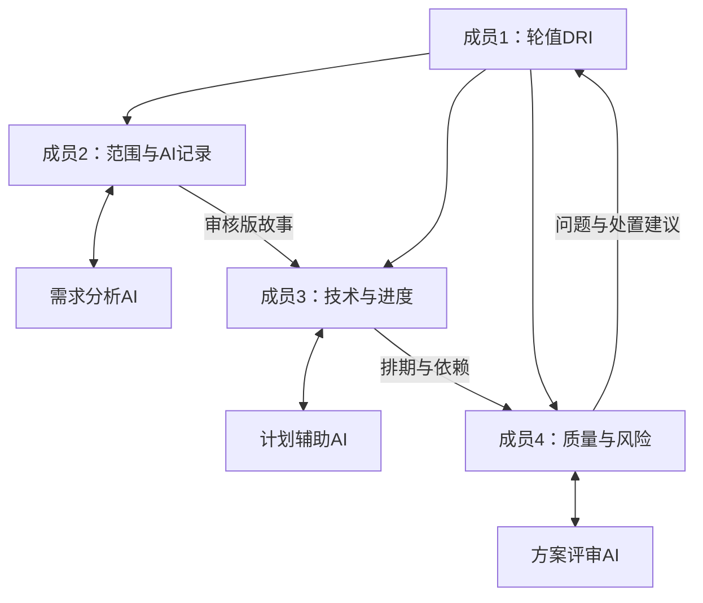

# 爱管理｜依据实验指导书的详细规划

版本：v1.0，会前审核稿。团队号：〔填写〕；本轮DRI：成员1〔姓名〕；项目起始日期：〔填写〕。

## 0. 先看结论：这次到底要做什么

你们的最终项目是“爱管理”，一个支持软件团队管理需求、安排任务、使用四种联动视图和六项AI能力的平台。第一次实验的直接任务是把项目组织起来，形成第一版可执行规划并提交六项材料；指导书没有要求第一次实验就把全部软件开发完成。

**当前最重要的行动：四人审核本稿 → 至少两个不同AI角色实际参与规划 → 启动会作出真实决定 → 完成故事地图、6周甘特图及4+n方案 → 整理记录与自评 → 提交。**

本次交付的规划甘特图安排你们开发“爱管理”的工作；产品甘特图是你们要开发的可交互功能。两者都要有。规划时使用的AI智能体与产品内六项AI功能也属于两个层面。

### 0.1 本稿的依据与适用范围

依据一：本次上传的《软件项目管理》实验指导书，文件名 f31bb982-12e1-476c-913b-dc040352e925.docx。该文件实际只包含“实验一 项目启动与规划（4学时）”，并提到下一轮“范围管理/Sprint 1”；没有提供实验二至四的完整指导或日期。

依据二：此前上传的“爱管理”项目介绍HTML，保留其具体功能要求。依据三：你转述的课堂要求——共4次实验课，最终完成全部内容，可以使用AI规划和编码。

本稿以新指导书为本轮规范，以课堂说明约束最终范围。6周现已是明确要求，不再是假设；3个两周Sprint、每周具体工作安排、工时估算、技术方案和验收细节仍是团队待审核的建议。

旧预备工作包中“暂缓部分最终必做功能”的建议作废。此前《全功能清单与验收草案》的36项功能可继续作为细化参考，但以本稿补充的自动生成时序图、工作量估算、测试质量分析等要求为准；不直接沿用旧估时和分工。

### 0.2 这次新增明确的硬性要求

|指导书要求|本稿落点|团队还需要做什么|
|---|---|---|
|项目周期6周，Scrum推进|第3—4节：3个两周Sprint与6周计划|填写真实起止日期，核对成员容量|
|故事地图有角色、骨干活动、故事、MoSCoW、至少3个Sprint切片|第3节|审核并调整故事，确认优先级|
|甘特图含任务条、责任人和关键里程碑|第4节|确认估时、周内顺序及M1—M4日期|
|4人分工、DRI轮值顺序|第5节、提交表1|填写姓名学号和轮值顺序|
|至少2个不同角色AI智能体定义且实际使用|第5、7节，建议3个角色|真实执行、当场记录、人工决定|
|团队协作结构示意|第5节|确认实际协作关系|
|六项电子交付物，团队号_交付物名称|第8节|按实际过程补齐并按时提交|
|五维自评使用优/良/中/待改进，含AI专项评估|第9节|用真实证据填写，不预填评价|

## 1. 实验1的课堂执行安排

### 1.1 课前先完成（建议四人各20—30分钟）

成员1：阅读指导书与本稿第0、8、9节，准备会议议程与提交清单；收集实验日历。成员2：审核第2—3节故事、用户价值与范围。成员3：审核第4节依赖、估时和技术难点。成员4：检查第5—7节AI角色、质量风险与记录方式。所有人确认至少一个可用AI工具、写出未来6周每周可投入时间。

按指导书预习教材中的项目约束、范围与优先级、甘特图与里程碑，以及OPC、DRI、CEO和“以本驭智”的相关内容。将CEO三问用于愿景讨论，将DRI责任落实到行动项。

### 1.2 4学时内的建议节奏

下表按每学时45分钟、共180分钟净活动时间示例；休息和学校实际学时安排另计。若每学时不是45分钟，按比例调整。

|累计分钟|全组活动|主要产出|
|---|---|---|
|0—15|登记成员、轮值顺序、工具；分配本轮职责|表1草稿、AI角色定义|
|15—40|DRI主持启动会：CEO三问、范围、规则、初始风险|表2实时记录、暂定决策与遗留问题|
|40—70|需求AI角色辅助审核故事；全组明确处置|故事地图、3个Sprint切片、需求AI原始记录|
|70—100|计划AI角色根据确认故事和容量估算排期；人工检查|WBS、甘特图、估时修改依据|
|100—120|完成4+n结构与责任；评审AI交叉检查|团队规划、问题清单、评审记录|
|120—145|修订范围／进度，DRI确认本轮基线；预留返工|审定规划v1、决策记录|
|145—165|汇总全过程记录，五维自评与AI专项讨论|表3、表5初稿|
|165—180|DRI写寄语，全组按评分项核对并提交|六项交付物、提交确认|

启动会可以形成初步共识，后续规划讨论再补充决议，记录时间和版本；不能把AI后来生成的内容倒填成启动会当时的结论。

### 1.3 启动会可以直接讨论的CEO三问

给谁用：课程及小型软件研发团队中的管理员、项目负责人、团队成员和查看信息的用户。

为什么值得做：把需求、任务、人员、排期与设计资产关联起来，减少重复记录和信息不一致；让AI建议基于项目实际数据并经人审核。

不做会怎样：团队仍需在多个工具中重复维护信息，需求变更的影响可能漏传，排期和人员负载容易脱节。这是待团队验证的问题假设，不是已经测量过的收益。

## 2. 完整产品范围与本轮边界

### 2.1 最终必须覆盖的能力

|能力域|最终交付内容|对旧清单的关键补充|
|---|---|---|
|用户管理与权限|项目成员、自定义角色、分配权限、数据访问控制|不能用固定角色演示代替创建角色|
|任务与协作|用户故事地图、需求池、负责人、状态、迭代；看板拖拽、列自定义、WIP、筛选与跨迭代对比|地图与看板用途区分，数据关联|
|甘特图|可交互排期、任务依赖、关键路径、里程碑|需求变更影响排期，不能只同步状态颜色|
|成员任务图|任务查看与分发、负载热力图、均衡分配、闲置预警|状态变化和指派变化都应驱动更新|
|UML图|用例图自动生成、时序图自动生成及交互编辑、类图关联代码、需求影响标注|新指导书明确从看板/甘特数据生成用例与时序图|
|数据与分析|可核对报表、基于历史数据的趋势|从开发早期记录变更，避免后期无历史可用|
|智能需求拆解|解析PRD，提取实体/关系/优先级、形成故事并估算工作量|增加估算结果、依据、假设与人工修正|
|进度预测|结合历史与当前范围预测交付日期|冷启动与合成数据验证须说明|
|智能排期|综合人员能力、任务依赖、优先级和容量生成建议|不能只按日期顺排或忽略人员能力|
|风险预警|多维识别延期及质量风险，给出应对方案|输出可落实的责任建议与行动|
|质量分析|代码、文档、测试质量自动评估|增加测试质量，不虚构测试执行结果|
|效率优化|识别瓶颈、提出流程改进、跟踪结果|建议能回流需求/任务，支持后续复查|

本轮交付“看见需求”的第一版规划基线，重点把三大史诗拆成可执行故事和至少3个Sprint切片；同时保留一体化、AI化的完整路线图。后续功能分期细化，不能因为本轮聚焦第一阶就从最终范围中删除。

### 2.2 合理的范围排除项

候选Won’t：企业级多租户计费、手机原生客户端、多语言国际化、自研大模型训练、大规模高可用集群。这些是蓝图外扩展。四视图与六项AI均不列入Won’t。

“需求变更自动同步排期”建议实现为：批准需求变更后，更新关联任务数据并重算受影响排期；显示变更前后、传播范围与冲突。对已批准基线的重排需保留历史，并明确何时需要再次确认。是否要求无需确认的自动改期需教师说明，不能只弹提示就声称实现全部同步能力。

时序图不能单靠开始结束日期推导消息交互。建议在故事中补充场景、参与者与交互步骤，再与看板/甘特上下文共同生成；信息不足时向用户询问，不编造业务流程。

## 3. 用户故事地图：3个Sprint的第一版基线

### 3.1 切片原则与MoSCoW

建议Sprint 1＝W1—W2，Sprint 2＝W3—W4，Sprint 3＝W5—W6。三个进阶方向不是三个互不相关的大模块；每个Sprint都应覆盖三个史诗中的用户价值，并交出可演示增量。

MoSCoW按本次6周发布范围解释：Must为最终必做；Should为有价值但非课堂明确必做的增强；Could为有余力再做；Won’t为本次不做。Must可以在Sprint 2或3交付，不代表第一轮全做。Sprint归属表示计划完成节点，研究和验证可提前。

### 3.2 二维地图

|发布切片|进入与组织项目（管理员）|梳理需求（负责人/成员）|安排与执行（负责人/成员）|观察与协同（团队）|复盘改进（负责人）|
|---|---|---|---|---|---|
|Sprint 1：基础流程|US01、US02|US03、US04|US05|US06|US07|
|Sprint 2：四视图协同|US08|US09、US14|US10、US11|US12、US13|US15|
|Sprint 3：完整智能闭环|US16|US17|US18|US19、US20、US21|US22、US23、US24|

三个史诗在三次切片中均有工作：用户权限US01/02→US08→US16；任务协作US03—06→US09—14→US17/18/21/24；数据分析US07→US15→US19/20/22/23。US08和US16是权限能力的逐步补齐，不是额外新增史诗。

### 3.3 故事清单及验收摘要

以下24条核心故事全部标为M（Must）；验收摘要为建议。对应旧36项编号方便追溯，新指导书新增点以“新增”标注。

|ID／Sprint／史诗|作为……我希望……以便……|验收摘要／追溯|
|---|---|---|
|US01／S1／用户权限|作为管理员，我希望建立项目并管理成员，以便限定协作范围。|成员可进入所属项目，非成员页面及接口访问拒绝；B01|
|US02／S1／用户权限|作为管理员，我希望创建角色并分配权限，以便控制操作边界。|新建只读角色实际无法修改；B02|
|US03／S1／任务协作|作为负责人，我希望维护史诗、故事和验收条件，以便形成需求基线。|故事有角色、目标、价值、优先级、活动、迭代和稳定ID；B03、K01|
|US04／S1／任务协作|作为成员，我希望按活动和Sprint查看故事地图，以便理解版本目标。|至少3个发布切片，与需求条目数据一致；K02|
|US05／S1／任务协作|作为负责人，我希望拆任务、分配负责人并安排日期，以便成员开展工作。|任务关联故事，日期与成员合法，可再次读取；B03、K03|
|US06／S1／任务协作|作为成员，我希望在看板更新状态，以便团队知道进展。|状态、负责人、优先级可见，刷新后保留；记录变更历史；K03、B04|
|US07／S1／数据分析|作为普通用户，我希望查看基础报表，以便掌握当前进度。|状态数、完成比例与任务清单一致；空项目正确；D01|
|US08／S2／用户权限|作为管理员，我希望新视图遵守已配置权限，以便避免绕过控制。|甘特/成员/UML读写接口均按权限校验；B02扩展验收|
|US09／S2／任务协作|作为成员，我希望拖拽卡片、自定义列并使用WIP限制，以便控制工作流。|拖拽持久化；满列阻止新增；删列先处理卡片；K04、K05|
|US10／S2／任务协作|作为负责人，我希望编辑甘特图、维护依赖及里程碑，以便掌握交付路径。|可交互编辑、拒绝循环依赖、关键路径样例正确、显示里程碑；G01—G04|
|US11／S2／任务协作|作为负责人，我希望查看负载并调配任务，以便减少过载与闲置。|按工时/容量生成热力图；确认调配后负载更新；阈值预警可验证；R01—R04|
|US12／S2／任务协作|作为团队成员，我希望需求、状态和指派变更同步到各视图，以便避免重复维护。|需求变更同步关联任务排期；状态及指派改变更新成员任务；跨端一致；L01、L02、L04＋新增|
|US13／S2／任务协作|作为设计成员，我希望从业务数据生成用例和时序图并编辑，以便支持评审。|故事/看板/甘特上下文可追溯；自动生成两类图；交互编辑保存；U01、U02＋新增自动时序|
|US14／S2／任务协作|作为负责人，我希望AI把PRD拆成故事并估算工作量，以便辅助需求细化。|真实输入产生草稿、估算依据和不确定项；人工确认后入库；A00、A01＋新增估算|
|US15／S2／数据分析|作为负责人，我希望筛选、对比迭代并查看趋势，以便识别变化。|组合筛选、跨迭代口径一致；趋势使用真实记录或标注样例；K06、D02|
|US16／S3／用户权限|作为管理员，我希望AI和设计资产遵守访问权限，以便保护项目数据。|越权用户不能借AI读取他项目或代码；建议写入需权限与人工确认；B02、A00扩展|
|US17／S3／任务协作|作为负责人，我希望修订AI故事与估算并追溯来源，以便控制需求变更。|保存输入与输出版本、采纳理由；重试不重复创建；A00、A01验收补全|
|US18／S3／任务协作|作为负责人，我希望AI综合能力、依赖、优先级和容量排期，以便得到可执行安排。|规则校验无缺失、无超载、能力匹配；不可行则说明；确认后四视图一致；A03＋新增能力/优先级|
|US19／S3／数据分析|作为负责人，我希望基于历史预测交付日期，以便提前调整。|说明历史窗口与假设；输入变化引起合理响应；数据不足提示；留出样例核对误差；A02|
|US20／S3／数据分析|作为负责人，我希望收到延期及质量风险与应对方案，以便采取行动。|定位任务/指标/质量问题，给出动作及后续检查；修正后风险更新；A04|
|US21／S3／任务协作|作为设计成员，我希望关联类图与代码、标注需求影响，以便维护设计一致性。|定位真实代码版本；改需求标记关联图元；删除代码提示失效；U03、U04、L03|
|US22／S3／数据分析|作为质量成员，我希望AI分析代码、文档和测试质量，以便发现遗漏。|三种输入均有定位与建议；测试缺失/覆盖不足样例能解释；不虚构运行测试；A05＋新增测试质量|
|US23／S3／数据分析|作为负责人，我希望AI识别瓶颈并建议改进，以便优化流程。|用历史积压和负载说明依据；动作可转成任务，定义复查指标；A06|
|US24／S3／任务协作|作为负责人，我希望串联需求拆解、排期、预警与优化，以便持续管理项目。|同一项目跑通闭环，关联同一批ID；确认/失败/恢复可追溯；L05|

### 3.4 非必做候选项的优先级

|ID|候选故事|MoSCoW／处理|
|---|---|---|
|EX01|作为用户，我希望导出报表为CSV，以便线下分析。|Should；暂不占核心计划工时，核心范围通过后再估算|
|EX02|作为用户，我希望自定义主题，以便调整显示偏好。|Could；不影响必做验收|
|EX03|作为平台经营者，我希望向企业客户计费，以便商业运营。|Won’t；不纳入6周范围|

不为凑齐优先级而把必做功能降级。Should/Could若获批准加入，必须补工作量及排期，不视为“免费加分”。

## 4. 6周WBS、甘特图与里程碑

### 4.1 估算方式及限制

下表是AI给出的首次讨论估算，总计200人时，包含AI提示与结果审核、实现和必要测试，不是已经被团队证明可行的承诺。依据是模块拆分、依赖和高不确定性功能的相对规模，尚无团队历史生产率。

如果四人均能投入每周10小时，则6周容量240人时，剩余40人时约占总容量16.7%；其中实验课时是否计入这10小时须统一口径，不能重复计算。10小时是例子，必须换成每人实际容量。若实际总容量不足，先重新估算、调配分工、复用工具并确认实现深度，不能私自删除必做能力。

每个主责在首次小样验证后重估乐观/最可能/悲观工时，记录与本表的差异及原因。UML、AI排期、联动和测试质量分析尤其可能超出本轮粗估。

### 4.2 WBS及负责人

M1—M4的命名沿用指导书建议。AI执行者负责辅助产出，每项仍指定一名自然人最终负责。

|任务|内容／故事|估算人时|计划窗口|前置条件|自然人主责／AI辅助|
|---|---|---:|---|---|---|
|T01|启动会、基线、六项材料初稿|12|W1|成员及资料就绪|成员1／需求AI、计划AI、评审AI|
|T02|共享数据、接口、AI接入约定；UML及排期小样|12|W1|T01的初步范围|成员3／计划AI、编码辅助|
|T03|项目、成员、自定义权限／US01、02|16|W1—W2|T02接口约定|成员1／编码辅助|
|T04|故事、地图、任务、基础看板／US03—06|16|W1—W2|T02；联调需T03|成员2／需求AI、编码辅助|
|T05|基础报表、历史记录、Sprint1验证／US07|12|W2|T03、T04|成员4／评审AI、编码辅助|
|T06|看板增强、筛选、趋势／US09、15|12|W3|T04、T05|成员2／编码辅助|
|T07|甘特图与成员任务图／US10、11|12|W3—W4|T02、T04|成员3／编码辅助|
|T08|UML自动生成与交互编辑／US13|20|W2—W4|T02；业务联调需T04|成员4／需求AI、编码辅助|
|T09|权限扩展、需求/状态/指派联动／US08、12|8|W4|T06—T08|成员1／评审AI|
|T10|AI拆解、估算、人工确认／US14、17|12|W2—W4；W5复核|T02、T04|成员2／需求AI、编码辅助|
|T11|AI进度预测和智能排期／US18、19|12|W4—W5|T05、T07、T10|成员3／计划AI、编码辅助|
|T12|AI代码/文档/测试质量分析／US22|12|W4—W5|T02 AI约定、实际样例|成员4／评审AI、编码辅助|
|T13|AI风险、效率、权限与闭环／US16、20、23、24|12|W5—W6|T09—T12；历史数据|成员1／评审AI、编码辅助|
|T14|类图代码关联及影响传播／US21|12|W4—W5|T08、变更历史|成员4／编码辅助|
|T15|完整回归、联调修正、部署与演示准备|12|W6|T11—T14|成员3／全员、评审AI|
|T16|Scrum评审/复盘、轮值交接、记录归档|8|W1—W6|随工作持续|成员1／全员、记录辅助|
|合计||200||||

主责不是唯一执行人。成员4的主责任务较重，需要从T02后明确支援；这张表没有通过逐人逐周资源校核，不得把“总人时足够”写成“排期已经可行”。表中重叠窗口允许原型和小样提前，依赖完成后才能集成验收；W6应先完成T13，再进行T15完整回归。

### 4.3 相对周甘特图

■＝工作窗口；◆＝里程碑。正式提交时在W1—W6下填公历范围。图中任务ID的责任人见上一表，应作为同一份甘特图说明一起提交。

|任务／责任人|W1|W2|W3|W4|W5|W6|
|---|:---:|:---:|:---:|:---:|:---:|:---:|
|T01 启动规划／成员1|■||||||
|T02 接口与小样／成员3|■||||||
|T03 权限基础／成员1|■|■|||||
|T04 故事任务／成员2|■|■|||||
|T05 报表与S1验证／成员4||■|||||
|T06 看板趋势／成员2|||■||||
|T07 甘特与成员图／成员3|||■|■|||
|T08 UML生成编辑／成员4||■|■|■|||
|T09 权限与联动／成员1||||■|||
|T10 AI拆解估算／成员2||■|■|■|■||
|T11 AI预测排期／成员3||||■|■||
|T12 AI质量分析／成员4||||■|■||
|T13 AI风险效率闭环／成员1|||||■|■|
|T14 类图与影响／成员4||||■|■||
|T15 完整验收交付／成员3||||||■|
|T16 管理与证据／成员1|■|■|■|■|■|■|
|里程碑|◆M1|◆M2||◆M3||◆M4|
|Sprint|S1|S1|S2|S2|S3|S3|

采用表格甘特图便于直接修改和打印。任务窗口不等于每天满负荷，也不是已计算的关键路径。开发计划中的关键路径与产品必须实现的关键路径算法是不同对象。

### 4.4 里程碑验收

M1，W1：需求与规划基线。六项实验1材料完整；≥3个Sprint切片；≥2个AI角色实际使用记录；全组审核并留决议。

M2，W2末：第一次Sprint评审。US01—07通过，能创建项目、配置角色、组织需求、安排任务、更新状态并查看报表；记录评审意见和未完成项。

M3，W4末：中期评审。US08—15通过，四视图可联动，用例/时序自动生成可演示，AI拆解与估算真实可用；审核剩余风险与容量。

M4，W6末：成果展演。US16—24通过，并对全24条回归；类图代码关联、六项AI、跨视图同步完整演示，提交实际已知问题与运行说明。后续实验的正式交付要求需拿到指导书后补入，不能用本计划代替。

### 4.5 容量表必须补齐

|成员|W1可用小时|W2|W3|W4|W5|W6|技能/其他约束|
|---|---|---|---|---|---|---|---|
|成员1|〔填〕|〔填〕|〔填〕|〔填〕|〔填〕|〔填〕|〔填〕|
|成员2|〔填〕|〔填〕|〔填〕|〔填〕|〔填〕|〔填〕|〔填〕|
|成员3|〔填〕|〔填〕|〔填〕|〔填〕|〔填〕|〔填〕|〔填〕|
|成员4|〔填〕|〔填〕|〔填〕|〔填〕|〔填〕|〔填〕|〔填〕|

审核动作：将每项工时分摊到人和周，检查超载与依赖；超载则重分配或调整窗口；将所有调整写入决策记录。DRI没有权力通过修改数字掩盖实际不足。

## 5. 4+n团队规划与Scrum协作

### 5.1 人类角色与轮值

|成员|本轮管理职责|候选技术职责|本轮具体产出|
|---|---|---|---|
|成员1|DRI、产品与范围最终协调|权限、公共服务、风险与闭环|主持启动会，整合、自评、寄语、提交|
|成员2|产品故事细化、AI协调与记录|故事看板、趋势、AI拆解|地图、AI登记与原始记录、采纳台账|
|成员3|技术与架构、估算排期|数据接口、甘特/成员图、AI预测排期|WBS、甘特图、容量核查|
|成员4|质量与风险、交叉审查|UML、质量分析、验收|纪要初稿、DoD、风险清单、检查表|

候选轮值：实验1成员1 → 实验2成员2 → 实验3成员3 → 实验4成员4。填写姓名学号并由全组确认。每项结果有且仅有一名自然人最终负责；复核人不等于第二个最终责任人。

4次实验课与3个Sprint并不一一对应。DRI按实验轮次轮换，Sprint按6周日历推进；跨轮交接记录当前Sprint、未决事项、风险、版本与下一里程碑。模块维护责任不必随着DRI轮换全部重置。

Scrum建议：共同维护产品待办列表；每个Sprint开始确认目标和可承诺任务；开发日做简短进展同步；每周至少一次集成；Sprint末展示可用增量、收集反馈并复盘。具体频率按团队课表落实，不虚构已经发生的站会。

### 5.2 AI角色定义（建议n=3，最低要求n≥2）

|名称|职责|典型输入|预期输出|边界与人工审查|
|---|---|---|---|---|
|需求分析AI|愿景、故事补全、优先级与切片建议|指导书、项目介绍、课堂补充、已确认边界|带来源的故事、3个Sprint地图、歧义清单|成员2先审，再由全组决定；不得把推断当必做需求|
|计划辅助AI|任务拆分、估时、依赖、容量冲突|审核版故事、逐人容量、日历、技术约束|WBS、6周排期、假设、超载和调整选项|成员3验证；不得替团队承诺日期或删除必做功能|
|方案评审AI|范围、进度、责任、质量与风险交叉检查|原始要求、审核版地图/WBS/分工|定位明确的问题清单和修正建议|成员4逐条复核；DRI确定最终处置；不得虚构测试和自评|

编码阶段可以再定义编码辅助或测试辅助角色，但本轮先把上述角色实质使用并记录好，不为增加n而堆角色名称。当前材料由本对话中的一个助手整理，不能据此宣称已经完成了独立的3智能体协作。

### 5.3 协作结构示意

若编辑器不渲染Mermaid，可按此结构重绘后插入正式方案。图中成员对AI输出作审核；不是AI直接把结果写进正式基线。

协作规则：同一文档版本传递；每项决策记录“建议—证据—处置—理由—责任人”；代码进入主分支前由另一名成员审阅；AI不能无审核改需求、合并代码或宣称验收通过。原始资料、工作稿、审核版和提交版分开命名。

## 6. DoD、风险与范围变更

### 6.1 本轮规划完成定义（DoD）

完成不等于“AI生成了一份文档”。需要：故事地图满足五要素且≥3切片；甘特图覆盖6周且有人和里程碑；4+n含轮值、≥2实际AI角色、边界及结构图；六项材料齐全；故事、任务和排期能追溯；团队已经审核并记录采纳/修改/否决理由；记录真实；未决问题明确到人和期限。

正式承诺排期还须完成容量校核。若课堂截止前仍未拿到全部日期或容量，应真实说明待确认项与补齐时间，不写“已确认可行”。

### 6.2 后续产品DoD

故事满足已确认验收条件；实现可运行、可保存、可再次读取；核心权限与异常路径验证；另一成员审阅；跨视图一致；AI调用及人工确认真实；测试执行与报告可追溯；运行说明与已知问题更新。测试质量分析必须覆盖测试用例或测试代码、执行报告等实际输入，说明检查范围，不把AI分析当作已运行测试。

新增验收样例：改变一条需求的工期约束，检查关联甘特排期与冲突传播；用含交互步骤的故事生成时序图并交互修改；给两个能力标签不同、容量相同的成员排期，检查能力匹配；提供遗漏边界用例的测试集，检查质量分析是否定位缺口。

### 6.3 风险登记草案

|风险／初判|可观察信号|应对|自然人主责|
|---|---|---|---|
|全功能工作量超容量／高|重估超过可用人时、连续拖延|先验证难点；复用工具；细化实现深度；重排和说明困难|成员1|
|AI乐观估算／高|工时无依据、忽略集成测试|保留初估；小样后重估；检查逐人逐周容量|成员3|
|视图和状态口径不一致／高|状态、日期、负载互相矛盾|统一ID和接口；约定故事/子任务汇总；持续集成|成员3|
|UML推断不足／高|任务名无法推导消息或代码关联|补结构化场景和代码版本；尽早验证两类自动生成|成员4|
|预测无历史数据／高|仅有当前任务快照|早期记录变更；可用合成样例验证并标注；不冒充真实精度|成员2|
|AI臆造需求与质量结论／高|无来源功能、不存在的测试通过|要求定位和依据；人工校验；拒绝或修改并留证据|成员4|
|模型不可用或成本超预期／中|调用失败、额度不足|W1验证；设置预算；保留人工业务入口，AI未完成如实记录|成员1|
|轮值责任断裂／中|无人处理遗留问题|交接清单含版本、阻塞、风险、责任人、期限|当轮DRI|
|原始记录缺失／中|只有摘要、缺完整输出|每次立即保存，表3关联原文；不补造|成员2|

变更流程：提出变更及来源 → 成员2判断用户价值 → 成员3估算范围/进度影响 → 成员4检查质量/风险 → 当轮DRI组织团队决定 → 更新故事、WBS、甘特图及版本。保留第一版基线，允许有依据地调整；不把“欢迎变更”解释为无需控制范围。

## 7. 实际使用AI与原始记录

本指导书要求至少2个不同角色实际参与，不只是写两份角色说明。建议成员2、3、4各开一个独立会话或工具支持的角色实例，使用下面提示词并附对应资料。是否认可人工编排角色会话，若教师有平台要求则按其要求；不要谎称后台自动协作。

### 7.1 需求角色提示词

> 你是“爱管理”需求分析智能体。依据附件实验指导书、产品介绍及课堂“最终全部完成”的要求，审查现有US01—US24。区分明确要求和建议；确认三大史诗、角色、骨干活动、MoSCoW和至少3个Sprint切片。指出遗漏、过大故事、不可测验收及不当删减，给出定位与修正建议。项目6周，本轮聚焦第一版可执行需求基线，不要求本轮全部编码。不得把你的新增想法标成教师要求。

成员2操作：保存完整回复 → 逐项标注采纳/修改/否决及理由 → 将审核版交给计划角色。

### 7.2 计划角色提示词

> 你是计划辅助智能体。依据审核版故事、团队逐人每周容量〔填写〕、实际6周日期〔填写〕及技术约束〔填写〕，审查T01—T16的200人时初估。给出任务细分、估算依据、依赖、自然人主责、AI辅助、6周甘特图和M1—M4。先指出容量或信息缺口，再给条件性建议。识别同周任务的先后约束、联调和返工时间，不以AI可编码为由省略审核测试，不自行删除最终必做功能。

成员3操作：重点检查成员4负载、T07/T11估时、W6先后次序；记录自己的判断，不直接照抄。

### 7.3 评审角色提示词

> 你是方案评审智能体。对照指导书，按过程协作20%、完整规范35%、人机协同真实性25%、自评反思20%检查当前材料。检查地图—故事—WBS—甘特图的覆盖，尤其UML自动时序、AI估算、能力约束排期、测试质量分析和需求变更联动。输出定位、影响、建议、待人确认项。检查是否实际使用≥2角色、是否有完整原始记录。没有证据就标待补，不虚构会议信息或给团队预填等级。

### 7.4 表3记录模板

|序号|时间|工具/角色|任务场景|提示词摘要|AI输出要点|团队处置及理由|
|---|---|---|---|---|---|---|
|〔填〕|〔真实时间〕|〔实际工具与角色〕|〔如故事审查〕|〔摘要＋原文位置〕|〔要点＋原文位置〕|〔具体建议的采纳/修改/否决及理由、审核人〕|

表3按指导书填摘要，同时保存完整提示词、输出、追问、附件版本及截图/导出。摘要表加原文附件共同满足全过程可追溯。课前真实对话可标注“课前准备”，不伪装成课堂对话，也不能代替本轮所需的至少两个角色实际参与。

可供团队核验的真实修正线索：此前助手建议暂缓部分功能，你补充课堂“全做”后纠正了范围；此前6周曾是假设，本次指导书将其确认为明确条件；旧清单未充分覆盖自动时序图、测试质量分析，本次补齐。这些可用于讨论AI局限，只有团队实际审核并记录后才能作为其处置证据。

## 8. 六项提交物：内容与命名

将“团队号”替换为真实编号。以下扩展名按教师平台支持的文档格式选择；可编辑源稿保留，图表确保在提交版本中可见。

|序号／文件名|必须包含|建议执笔／最终负责|
|---|---|---|
|01 团队号_团队组建与DRI轮值表|队名、背景爱管理、4人姓名学号分工、轮值顺序、AI工具|成员2／成员1|
|02 团队号_项目启动会会议纪要|时间地点、人员含实际列席AI、主持、CEO三问、范围、规则、风险、行动与期限、遗留问题|成员4／成员1|
|03 团队号_项目规划方案|本稿审核后的地图、MoSCoW、≥3切片、6周甘特与M1—M4、4+n定义和结构图；建议附WBS/DoD/风险|成员2、3、4分工／成员1|
|04 团队号_AI互动原始记录|表3、完整原始对话、输入附件版本、逐条处置及理由|成员2／成员1|
|05 团队号_4+n团队项目规划自评报告|指导书表5五维自评和AI专项四问|全员讨论、成员1执笔／成员1|
|06 团队号_DRI期望寄语|致下一轮DRI，100字以内|成员1／成员1|

表1可直接填写：团队编号/队名〔〕；背景爱管理；成员1〔姓名/学号/分工〕；成员2〔〕；成员3〔〕；成员4〔〕；第1至4轮DRI〔〕；实际启用AI工具/平台〔〕。

表2可直接填写：时间/地点〔〕；真实参会人员与实际AI角色〔〕；主持人〔〕；CEO三问结论〔〕；范围共识〔〕；分工及规则决议〔〕；风险〔〕；行动项〔事项+责任人+期限〕；遗留问题〔〕。

会议决议候选题目：批准全功能范围与3个Sprint；确认实际容量；同意AI角色与审核方式；确认不确定功能的验收边界；批准下一个里程碑的行动项。候选题目不等于已经表决通过。

## 9. 按真实评分标准争取高分

指导书明确：过程参与与团队协作20%；交付物完整性与规范性35%；人机协同深度与记录真实性25%；自评深度与反思质量20%。并未给出更细分评分点，因此下列为对齐建议，不是额外官方评分条款。

|权重|把什么做好|建议保留的证据|
|---|---|---|
|20%过程协作|四人实际参与；DRI协调并交接；分工明确|会议发言/决策、各自审核记录、行动完成情况|
|35%完整规范|六项齐全；地图五要素、6周图、4+n结构；编号与内容一致|指导书表4核查、版本与交付清单|
|25%人机协同|至少2角色实际解决不同问题；人审查而非只复制|完整对话、逐项处置、修改前后对照|
|20%自评反思|五维有证据、有不足、有具体下轮改进；AI专项四问完整|真实错误案例、估算调整、遗留问题责任人|

优先补齐这些得分依据，再考虑额外原型美化。一个完整、可追溯、经人审查的计划，比增加无验收依据的功能承诺更值得本轮投入。

### 9.1 五维自评底稿（必须在实际过程后填写）

项目概况：本团队选择“爱管理”，本轮目标是建立4+n协作机制，并形成6周、至少3个Sprint的第一版需求与规划基线。本轮DRI：〔姓名〕。

|维度|我们实际做了什么|等级：优/良/中/待改进|证据|不足与下一轮动作|
|---|---|---|---|---|
|范围|〔角色/故事/MoSCoW/切片审核〕|〔填〕|〔版本、决策ID〕|〔谁、何时补齐什么〕|
|进度|〔估算、容量、依赖检查〕|〔填〕|〔改动与依据〕|〔谁、何时重估〕|
|团队|〔分工、轮值、AI审核落实〕|〔填〕|〔行动与交接〕|〔具体改进〕|
|质量|〔DoD、交叉审查与一致性检查〕|〔填〕|〔问题修正〕|〔具体改进〕|
|风险|〔识别及应对，含AI风险〕|〔填〕|〔风险/处置记录〕|〔触发条件与负责者〕|

### 9.2 AI专项四问底稿

① 分环节表现：分别填写愿景讨论、故事拆解、估算排期、分工设计、方案审查中实际发生的作用和不足，引用记录编号。

② 贡献与价值：写具体产出或发现的问题；无可靠计时就不写“节省百分之多少”。与“没有AI”比较时标注其为反事实估计，不冒充实际对照实验。

③ 风险与应对：至少讨论一个真实出现的修正案例，说明谁发现、如何验证、修改了什么以及仍有什么不确定性。不要为了丰富报告人为制造错误。

④ 人的判断边界：需求取舍、容量承诺、验收认可、基线变更和最终责任均由人决定。候选原则：“AI提出可追溯的建议，人验证依据、决定采纳并承担结果责任。”

### 9.3 100字以内寄语候选

希望下一轮DRI先核对故事与验收标准，验证高风险功能，按真实容量承诺Sprint任务。持续关注依赖、成员负载和AI建议的依据，及时记录变更与问题，让团队交出可运行、可验证的增量。

使用前根据本轮实际遗留问题修改；不把候选寄语当作已经完成的个人反思。

## 10. 实验思考题的准备线索

有AI与无AI：可比较故事覆盖、排期错误识别、整理时间；区分实际记录和假设比较。

不可靠输出与自主权边界：从真实对话挑例子；解释为什么未经验证的估时不能直接成为承诺，以及AI能否自动操作应受可验证程度约束。

DRI职责：结合会议组织、消除阻塞、协调修改、提交审定的实际动作，区别于普通成员独立完成某一模块。

最大不确定性与下一轮准备：当前候选为UML自动生成/交互、AI排期可行性和实际团队容量。团队应从中选出自己最关键的一项，确定验证负责人、输入、成功标准和截止时间。

## 11. 最终审核与当前未决项

提交前逐项确认：六份材料命名正确；真实身份和轮值已填；地图包含角色/骨干活动/故事/MoSCoW/3切片；甘特覆盖6周、任务责任人及M1—M4；实际AI角色≥2且原始记录完整；协作结构可显示；自评使用指导书等级并含专项四问；寄语≤100字；草稿假设没有伪装成已达成事实。

目前仍需团队提供或核实：四人姓名学号与实际容量；6周公历起止与实验2—4时间；下一轮具体提交要求；可用模型、费用和部署环境；UML图形编辑/代码语言/自动生成深度；历史数据是否允许标注合成样例用于验收；实时联动和自动排期的具体确认规则。

这些不确定性不妨碍先审核故事、分工和执行AI角色。本稿已把今晚能提前写的规划内容填好；会议事实、团队处置、实际工时及自评等级留给你们真实完成。
